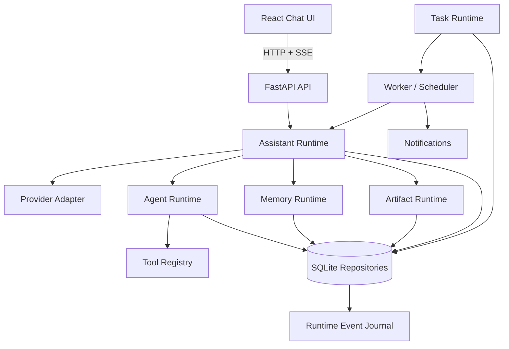

# Endless Task

Endless Task 是一个本地优先、面向单用户的个人 AI 助手 Runtime。产品首先是一款类似 ChatGPT 的聊天应用；文件读取、记忆、成果交付和长期任务都由 Assistant 在对话中按需使用，而不是让用户先理解 Task、Agent Run 或工作流。

## 当前开发基线

- 包版本：API/Web `0.5.0`。
- 当前阶段：Runtime v2 v1.1 Feature Integration Candidate；自动化与隔离迁移恢复基线已通过，但仍不是 Release Candidate。
- 当前能力：Workspace → Conversation → Lane、Runtime v2 执行/恢复/审批、Memory、Knowledge、Artifact、Task/Reminder、Skill/MCP 与会话级 Provider/Model。
- 默认运行：Agent Runtime 使用 v2（可用 `ENDLESS_TASK_RUNTIME=v1` 进入只读兼容路径）；后端默认 `FakeProvider`，无需 API Key，配置 DeepSeek/OpenAI-compatible Provider 时密钥只存在于 API 进程环境中。
- 发布事实与剩余门槛以 [`docs/v2/agent-runtime-v2-v1.1-release-readiness.md`](docs/v2/agent-runtime-v2-v1.1-release-readiness.md) 为准。

## 产品原则

1. **Chat-first**：聊天是唯一主入口，工具和任务是 Assistant 的内部能力，不暴露 Chat / Work 模式。
2. **Local-first**：会话、事件、文件、记忆、成果和任务状态默认保存在本地 SQLite。
3. **User-controlled**：只读工具可以自动执行；写入、长期行为和敏感操作必须经过用户确认。
4. **Runtime-first**：先保证状态机、持久化、恢复、幂等、取消和边界清晰，再扩展能力。

## 已完成能力

| 阶段 | 能力 | 可验证重点 |
|---|---|---|
| `P0` | 本地聊天、OpenAI-compatible Provider、SSE 流式回复 | Turn 状态机、事件持久化、`Last-Event-ID` 重放、取消/重试/重新生成 |
| `P1` | 工具协议、受限 Agent Loop、只读文件工具、审批链路 | 工具参数校验、循环上限、只读自动执行、副作用一次性确认、自然 Activity |
| `P2` | Memory Runtime | 记忆提案、用户确认写入、跨会话注入、来源/冲突/过期处理、管理接口 |
| `P3` | Artifact Runtime | Artifact 生成、版本管理、来源引用、聊天继续修改、Markdown/HTML/PDF 导出、按需工作区 |
| `P4` | Task Runtime 与一次性提醒 | 自然语言任务提案、确认、Worker、Scheduler、暂停/恢复/取消、结果通知、幂等、失败恢复、错过调度补偿 |
| `R5–R8` | Knowledge、Workspace Runtime、Skill/MCP、Runtime v2 v1.1 | Conversation/Lane、审批恢复、结果落点、隔离 E2E 与迁移恢复 |

## 架构概览



注释：

- `Assistant Runtime` 负责普通对话、上下文构建、流式事件和 Turn 状态。
- `Agent Runtime` 只在需要工具时介入，默认工具仍以只读为主。
- `Memory / Artifact / Task Runtime` 都是 Assistant 的能力层，不改变用户入口。
- `Runtime Event Journal` 用于刷新、断线和重连后的事件恢复。

## 本地运行

需要 Python 3.11+、[uv](https://docs.astral.sh/uv/) 和 Node.js 20.19+ 或 22.12+。

启动 API：

```bash
cd apps/api
uv venv .venv
uv pip install --python .venv/bin/python -e '.[dev]'
uv run endless-task-api
```

启动 Web：

```bash
cd apps/web
npm install
npm run dev
```

浏览器打开 `http://127.0.0.1:5173`。开发服务器会把 `/api`、`/health`、`/conversations`、`/capabilities`、`/workspaces`、`/providers` 等前端 API 请求代理到 `http://127.0.0.1:8000`。

## 语义检索配置（R5.8）

知识检索默认走纯字面路径。启用语义混合检索后，「字面 + 向量」加权融合，换说法的查询也能命中知识。参数注释同步维护在 `apps/api/.env.example`。

| 变量 | 默认值 | 说明 |
|---|---|---|
| `ENDLESS_TASK_EMBEDDING` | `0` | 总开关：`1` 启用语义混合检索 |
| `ENDLESS_TASK_EMBEDDING_BACKEND` | `local` | `local`=本地 ONNX 小模型；`provider`=OpenAI 兼容网关 `/embeddings` |
| `ENDLESS_TASK_EMBEDDING_MODEL` | 空 | provider 后端必填的嵌入模型名 |
| `ENDLESS_TASK_EMBEDDING_LOCAL_REPO` | `Xenova/bge-small-zh-v1.5` | 本地模型来源仓库（需含 `onnx/model.onnx` 与 `tokenizer.json`） |
| `ENDLESS_TASK_EMBEDDING_LOCAL_URL_BASE` | `https://huggingface.co` | 模型下载源，离线/内网可指向自建镜像 |
| `ENDLESS_TASK_EMBEDDING_MAX_CHARS` | `1500` | 单条嵌入文本截断长度 |
| `ENDLESS_TASK_EMBEDDING_BATCH` | `8` | 全量重建时的批量嵌入大小 |
| `ENDLESS_TASK_KNOWLEDGE_HYBRID_WEIGHTS` | `0.4,0.6` | 融合权重「字面,语义」，设为 `1.0,0.0` 退回纯字面排序 |

要点：

- `local` 后端首次启用时一次性下载模型（bge-small-zh-v1.5，约 90MB）到 `~/Library/Application Support/Endless Task/models/`，之后纯 CPU 离线推理，数据不出机；下载支持断点续传与指数退避重试，失败后自动降级并周期性自愈。
- `provider` 后端需要网关支持 `/embeddings` 且已配置 provider API key；`openai-compatible` 还需 `ENDLESS_TASK_BASE_URL`。
- 向量索引随知识源/记忆/成果/轮次的写入增量维护；也可手动管理：`uv run endless-task embeddings status` 查看配置与计数，`uv run endless-task embeddings rebuild` 全量重建（换模型后需重建）。
- 检索可见性规则不变：临时/归档/过期内容永不进入向量召回；嵌入不可用时自动退回纯字面检索，不影响对话主链路。

## 验证方式

当前开发基线：

- 后端：`uv run python -W error -m unittest discover -s tests -v`，616/616 通过。
- 前端：`npm run build` 通过。
- 浏览器：`npm run test:e2e`，桌面 13、移动端 1，共 14/14 通过。
- 依赖审计：`npm audit --json`，0 vulnerabilities。
- 迁移恢复：schema `042` → `045` 自动化 dry-run/apply/audit/restore、重复执行、部分失败回滚和损坏备份拒绝通过；`045` 另覆盖已应用旧版 `044` 的候选数据库修复。真实旧库与应用降级仍待正式验收。

后端测试：

```bash
cd apps/api
uv run python -W error -m unittest discover -s tests -v
```

前端构建与浏览器 E2E：

```bash
cd apps/web
npm run build
npm run test:e2e
```

重点测试资产：

- `apps/api/tests/test_p0_release_gate.py`
- `apps/api/tests/test_p1_release_gate.py`
- `apps/api/tests/test_memory_*.py`
- `apps/api/tests/test_artifact_*.py`
- `apps/api/tests/test_task_*.py`

## 演示主链路

1. 普通聊天与 SSE 流式回复，刷新后从事件日志恢复。
2. 上传文本文件，Assistant 自动选择只读工具，并展示自然 Activity。
3. 生成 Memory 提案，用户确认后跨会话注入。
4. 从对话生成 Artifact，查看版本、来源并导出。
5. 用自然语言创建周期 Task 或一次性提醒，展示确认、调度、失败恢复和结果通知。

## 安全与公开边界

- `.env`、本地数据库、日志和用户文件不应提交到仓库。
- API Key 只从后端进程环境读取，不进入浏览器、SQLite、API 响应或应用日志。
- 当前是单用户、本地优先项目，不声明多租户、集群化或海量并发能力。
- API 与开发 Web 只绑定 loopback，不得通过 `0.0.0.0`、端口转发或反向代理直接暴露到局域网或公网。
- 当前没有正式 production Web 静态托管、桌面安装包或统一进程管理入口；本地开发启动方式不等于发布交付方案。
- Runtime v2 v1.1 已进入功能集成候选阶段，但人工产品验收、真实旧库/应用降级演练、可复现 RC 与运维材料仍是发布门。

更多细节见 [API 说明](apps/api/README.md)、[Web 说明](apps/web/README.md)、[v1 归档文档](docs/archive/v1/README.md) 和 [Agent Runtime v2 规划](docs/v2/README.md)。
