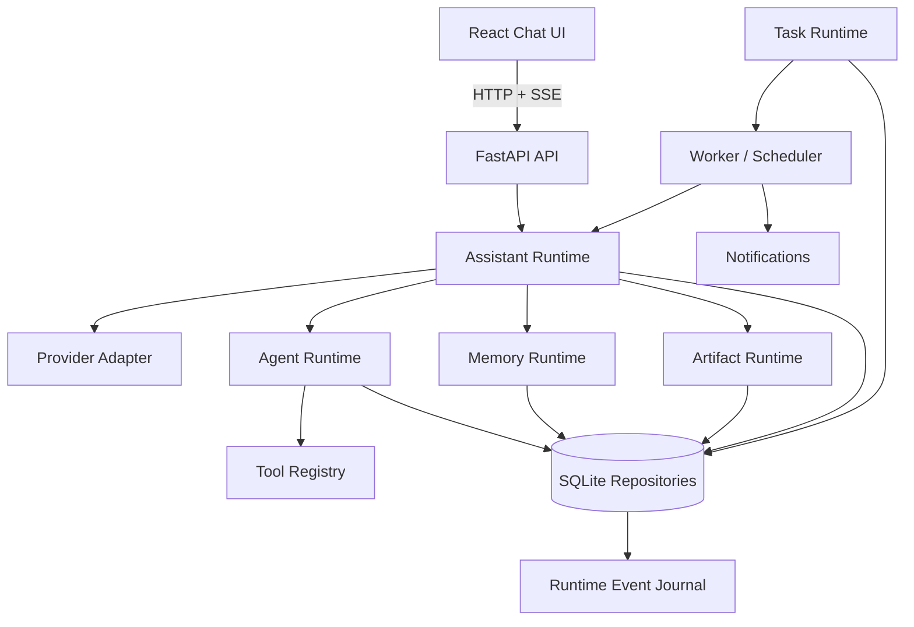

# Endless Task

> 本地优先、以聊天为唯一入口的个人 AI 助手 Runtime。
>
> **一句话定位**：一个像 ChatGPT 一样自然、但能把复杂事情真正「做完」的个人 AI 助手 —— 文件、记忆、成果交付和长期任务都由 Assistant 在对话中按需使用，用户不需要理解 Task、Agent Run 或工作流。


---

## 为什么做这个项目

在使用 ChatGPT / Claude / Codex / Cursor 的过程中，有一个反复出现的痛点：

> **我想在保留当前上下文的前提下，开启一个新的探索、或并行比较几个方案 —— 但现有产品做不到。**
> 新建对话会丢失上下文；在同一对话里尝试第二条路，会污染原来的对话和历史记忆。

Endless Task 的答案是 **Chat-first + 会话分支（Branch / Lane）**：以聊天为唯一入口，把「探索」和「主线」从模型层面分开，让用户既能并行尝试，又不破坏任何东西。

这不是一个 demo —— 它是一套从状态机到评测门禁完整实现的 Agent Runtime（自研 Runtime v2），当前处于 **Product Acceptance Candidate** 阶段，662 项后端测试、46 项浏览器 E2E 全部通过。

---

## 差异化能力

### 会话分支：共享上下文，但不破坏上下文

- **临时对话（Temporary Conversation）**：从当前会话创建、继承完整上下文快照，用于并排探索、对照、验证；不进入来源会话的分支树、不默认写入长期记忆、关闭即删除，可随时升级为独立正式会话。
- **持久分支（Persistent Branch）**：在会话内 fork 出正式分支，保留 fork 之前的全部历史，独立演化；支持继续 fork、重命名、设为主线、归档 / 恢复。
- **记忆作用域可解释**：临时探索不污染长期记忆；持久分支继承来源上下文但独立演化；有价值的探索结果可显式提升为长期记忆。

### Runtime-first：先可靠，再扩展

- 完整状态机（`pending → running → completed / cancelled / failed`），终端状态不可逆。
- 事件日志（Event Journal）+ `Last-Event-ID` 断线重连恢复，重放幂等、不重新产生副作用。
- 审批链路（approval gate）：写 / 危险工具必须用户确认后才执行，只读工具自动执行。
- 崩溃恢复：任务租约过期重新入队 + 消费端幂等键，保证不丢不重。
- 并发控制用版本号 + CAS 原子写，而非时间戳。

### 评估层：质量可回归（这是工程上最不常见的部分）

- 对**已录制**的 Run 做只读、确定性、可回归的批量打分。
- 指标：`completion`、`tool_correctness`、`approval_gate`、`robustness`、`efficiency`、`loop_detected`；安全规则永远是 blocker。
- `eval diff` 对比 baseline / candidate，质量回退超容差即返回非零，**可作为 CI 门禁**。

---

## 功能总览

| 能力 | 说明 |
|---|---|
| 💬 聊天 | SSE 流式回复、停止 / 重试 / 重新生成、断线恢复 |
| 📎 附件与文件 | 文本类文件读取、Agent 引用文件名、受控文件工具 |
| 🧠 记忆 | 记忆提案 → 用户确认写入 → 跨会话注入，来源 / 冲突 / 过期可处理 |
| 📦 成果（Artifact） | 生成、版本管理、来源引用、聊天中继续修改、导出 |
| ⏰ 任务与提醒 | 自然语言提案、确认、调度、暂停 / 恢复 / 取消、失败恢复、错过调度补偿 |
| 📚 知识 | 信息源管理、混合检索（字面 BM25 + 语义向量 + RRF）、DuckDB 受控只读 |
| 🧩 工具与 MCP | 工具注册、会话级 Skill / MCP、工具审批 |
| 🔀 会话分支 | 临时对话 + 持久分支 + 记忆作用域（差异化核心） |
| 🧪 评估 | 确定性指标 + `eval diff` CI 门禁 |

---

## 界面预览

<!-- TODO: 替换为真实截图（建议 3 张） -->

| 主界面 | 会话分支 / 临时探索 | 评估报告 |
|---|---|---|
|  |  |  |

> 图片待补充 —— 当前可以本地运行后自行截图，或用 `endless-task eval report` 导出评估报告截图。

---

## 快速开始

需要 Python 3.11+、[uv](https://docs.astral.sh/uv/) 和 Node.js 20.19+ / 22.12+。

```bash
# 启动 API（默认 FakeProvider，无需 API Key 即可体验完整产品状态）
cd apps/api
uv venv .venv
uv pip install --python .venv/bin/python -e '.[dev]'
uv run endless-task-api

# 启动 Web（另开终端）
cd apps/web
npm install
npm run dev
```

打开 <http://127.0.0.1:5173>。

配置真实模型（DeepSeek / OpenAI-compatible Provider）后，密钥只存在于 API 进程环境中，不会进入浏览器、SQLite 或日志。配置细节见 [apps/api/README.md](apps/api/README.md) 与 `.env.example`。

---

## 架构



设计原则：

- **Chat-first**：聊天是唯一入口，工具和任务是内部能力，不暴露 Chat / Work 双模式。
- **Local-first**：会话、事件、文件、记忆、成果和任务状态默认保存在本地 SQLite。
- **User-controlled**：只读工具自动执行；写入、长期行为和敏感操作必须经过用户确认。
- **Runtime-first**：先保证状态机、持久化、恢复、幂等、取消和边界清晰，再扩展能力。

---

## 工程质量

| 检查项 | 结果 |
|---|---|
| 后端单元测试 | 662 / 662 通过（`unittest`） |
| 前端构建 | ✅ production build 通过 |
| 浏览器 E2E | 46 / 46 通过（桌面 36 + 移动端 10，Playwright 隔离运行） |
| 依赖审计 | `npm audit` 0 vulnerabilities |
| 数据迁移恢复 | schema 042 → 045 自动化 dry-run / apply / audit / restore、重复执行、部分失败回滚、损坏备份拒绝 均通过 |

验证方式：

```bash
# 后端
cd apps/api && uv run python -W error -m unittest discover -s tests -v

# 前端构建与 E2E
cd apps/web && npm run build && npm run test:e2e
```

---

## 文档

- [Agent Runtime v2 架构](docs/v2/agent-runtime-v2-architecture.md)
- [Agent Runtime v2 核心概念](docs/v2/agent-runtime-v2-core-concepts.md)
- [分支与记忆模型](docs/v2/agent-runtime-v2-branching-and-memory.md)
- [状态与存储模型](docs/v2/agent-runtime-v2-state-and-storage-model.md)
- [评估层设计](docs/v2/evaluation-layer-design.md)
- [外部参考研究（Pi / Cherry Studio / Codex 借鉴与边界）](docs/v2/reference-research.md)
- [发布准备度审查](docs/v2/agent-runtime-v2-v1.1-release-readiness.md)

---

## 当前状态与路线图

**当前基线**（`0.5.0`，Runtime v2 v1.1）：

- Runtime v2 执行 / 恢复 / 审批、Memory、Knowledge、Artifact、Task / Reminder、Skill / MCP、会话级 Provider / Model、Workspace → Conversation → Lane 已实现并通过自动化基线。
- 阶段：**Product Acceptance Candidate** —— 工程链路已进入验收准备，但尚未完成 Product Accepted、Release Candidate 或 Release Ready 门槛。

**进入 RC 前剩余门槛**（不扩展新能力，优先完成）：

1. 人工产品验收（普通聊天、键盘 / 读屏、真实移动端）。
2. 真实用户旧库迁移恢复演练 + 应用降级演练（当前仅隔离工程演练）。
3. 用户可见产品语义审计（收敛技术术语与错误文案）。
4. 可复现 RC、运行手册与发布级观测。

**近期路线图**：

- 完成 Product Accepted → Release Candidate。
- 桌面打包（Tauri / Electron 评估）、发布流程。
- 更多文件与图片理解、网页搜索与来源引用。

---

## 安全与边界

- `.env`、本地数据库、日志和用户文件不提交仓库；API Key 只从后端进程环境读取。
- API 与开发 Web 只绑定 loopback，不得通过 `0.0.0.0`、端口转发或反向代理暴露到局域网 / 公网。
- 当前是单用户、本地优先项目，**不声明多租户、集群化或海量并发能力**。
- 默认无遥测；如未来提供，必须由用户主动选择开启。

---

## 附录：开发者指南

### 语义检索配置（R5.8）

知识检索默认走纯字面路径。启用语义混合检索后，「字面 + 向量」加权融合，换说法的查询也能命中知识。参数注释同步维护在 `apps/api/.env.example`。

| 变量 | 默认值 | 说明 |
|---|---|---|
| `ENDLESS_TASK_EMBEDDING` | `0` | 总开关：`1` 启用语义混合检索 |
| `ENDLESS_TASK_EMBEDDING_BACKEND` | `local` | `local`=本地 ONNX 小模型；`provider`=OpenAI 兼容网关 `/embeddings` |
| `ENDLESS_TASK_EMBEDDING_MODEL` | 空 | provider 后端必填的嵌入模型名 |
| `ENDLESS_TASK_EMBEDDING_LOCAL_REPO` | `Xenova/bge-small-zh-v1.5` | 本地模型来源仓库（需含 `onnx/model.onnx` 与 `tokenizer.json`） |
| `ENDLESS_TASK_EMBEDDING_LOCAL_URL_BASE` | `https://huggingface.co` | 模型下载源，离线/内网可指向自建镜像 |
| `ENDLESS_TASK_EMBEDDING_MAX_CHARS` | `1500` | 单条嵌入文本截断长度 |
| `ENDLESS_TASK_EMBEDDING_BATCH` | `8` | 全量重建时的批量嵌入大小 |
| `ENDLESS_TASK_KNOWLEDGE_HYBRID_WEIGHTS` | `0.4,0.6` | 融合权重「字面,语义」，设为 `1.0,0.0` 退回纯字面排序 |

要点：

- `local` 后端首次启用时一次性下载模型（bge-small-zh-v1.5，约 90MB）到本地应用数据目录，之后纯 CPU 离线推理，数据不出机；下载支持断点续传与指数退避重试，失败后自动降级并周期性自愈。
- `provider` 后端需要网关支持 `/embeddings` 且已配置 provider API key。
- 向量索引随知识源/记忆/成果/轮次的写入增量维护；也可手动管理：`uv run endless-task embeddings status` 查看配置与计数，`uv run endless-task embeddings rebuild` 全量重建（换模型后需重建）。
- 检索可见性规则不变：临时/归档/过期内容永不进入向量召回；嵌入不可用时自动退回纯字面检索，不影响对话主链路。

### 评估层 CLI

`endless-task eval` 对**已录制**的 v2 Run 做只读、可回归的批量打分（不走聊天热路径，不触发工具，不改 runtime 数据）。默认筛选用过工具的 `completed` Run，可用 `eval diff` 检测质量回退并作为 CI 门禁。

```bash
# 跑一轮确定性评估并持久化为一个批次
uv run endless-task eval run --require-tools

# 查看报告 / 导出
uv run endless-task eval report --batch BATCH
uv run endless-task eval export --batch BATCH --format jsonl

# 对比两个批次，blocker 指标回退超容差时返回非零退出码
uv run endless-task eval diff --baseline A --candidate B --tolerance approval_gate=0.05
```

确定性指标：`completion`（未完成/无输出=blocker）、`tool_correctness`、`approval_gate`（已知写/执行工具未审批=blocker）、`robustness`（Replay 状态冲突）、`efficiency`（tokens/轮数/工具数/耗时）、`loop_detected`（复用 `SafetyStopPolicy` 检测重复签名/连续失败）。设计见 [`docs/v2/evaluation-layer-design.md`](docs/v2/evaluation-layer-design.md)。

### 演示主链路

1. 普通聊天与 SSE 流式回复，刷新后从事件日志恢复。
2. 上传文本文件，Assistant 自动选择只读工具，并展示自然 Activity。
3. 生成 Memory 提案，用户确认后跨会话注入。
4. 从对话生成 Artifact，查看版本、来源并导出。
5. 用自然语言创建周期 Task 或一次性提醒，展示确认、调度、失败恢复和结果通知。

### 重点测试资产

- `apps/api/tests/test_p0_release_gate.py`
- `apps/api/tests/test_p1_release_gate.py`
- `apps/api/tests/test_memory_*.py`
- `apps/api/tests/test_artifact_*.py`
- `apps/api/tests/test_task_*.py`
- `apps/api/tests/test_eval.py`
- `apps/api/tests/test_conversation_branches.py`（分支 / Lane 语义）
- `apps/web/e2e/desktop/branch-temporary.spec.ts`（分支浏览器旅程）

---

## License

<!-- TODO: 开源前补充 LICENSE（建议 MIT 或 Apache-2.0） -->

---

*Endless Task 是一个个人驱动的研究型项目，目标是理解并实践「如何让一个 Agent 可靠地运行」。*
